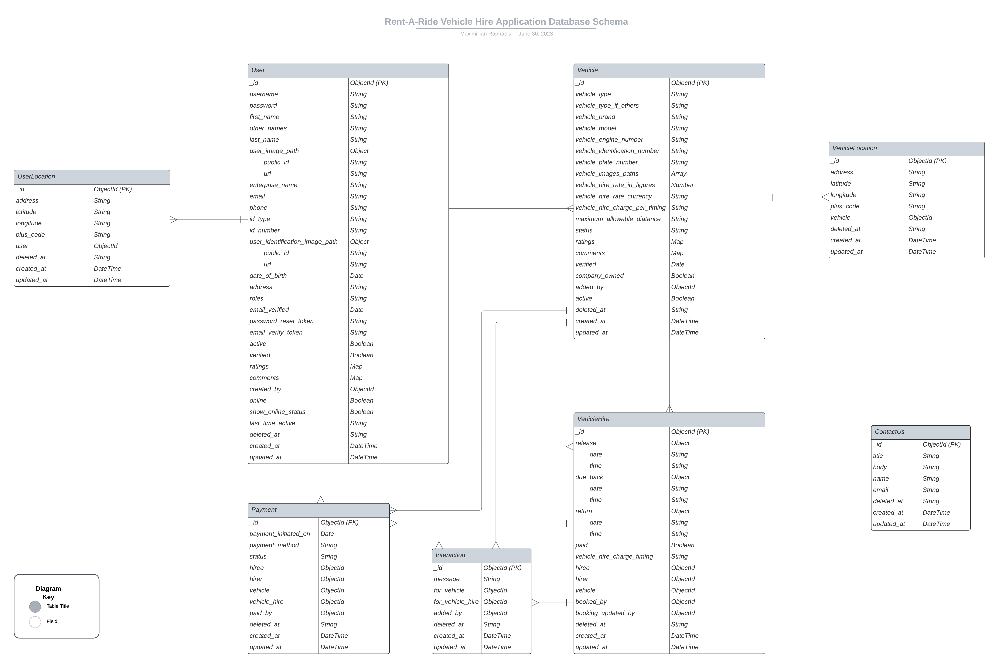

# Rent-A-Ride Vehicle Rental Application

Guide to (usage and description of) the Rent-A-Ride Vehicle Rental application.

**Table of Contents**

1. [What Rent-A-Ride Is](#what-is-rent-a-ride)
2. [Features of the Application](#features-of-the-application)
3. [Technical Features of the Application](#technical-features-of-the-application)
4. [Technologies Utilized in Crafting Rent-A-Ride](#technologies-utilized-in-crafting-rent-a-ride)
      1. [Server-side](#server-side)
      2. [Client-side](#client-side)
5. [API Documentation](#api-documentation)
6. [Database Structure](#database-structure)
7. [How to Install and Run the Rent-A-Ride Application Locally On Your Device](#how-to-install-and-run-the-rent-a-ride-application-locally-on-your-device)
      1. [Requirements](#requirements)
      2. [Installation Procedure](#installation-procedure)
         1. [Server-side Terminal](#server-side-terminal)
         2. [Client-side Terminal](#client-side-terminal)
8. [How to Generate Keys for your Environment Variable (.env) File](#how-to-generate-keys-for-your-environment-variable-env-file)
9. [Footnotes !important](#footnotes-important)

## What Is Rent-A-Ride?

Rent-A-Ride is a vehicle rental application where users can search for vehicles and hire. Vehicle owners can also put up their vehicles for hire.

(gif image showing working application comes here)

## Features of the application

1. There are 3 roles: user, vehicle owner and admin.
2. A user can choose to register as an user or vehicle owner.
3. Users can book vehicles. Vehicle owners can register their vehicles to be booked by users.
4. Users can like and comment on vehicles.
5. Users can search for vehicles for hire.
6. Users and vehicle owners can interact on a particular vehicle hire.
7. Vehicle and user locations can be tracked.
8. Payment can be made for each vehicle hire on the app.

[Click for more details and admin functions](https://nodejs.org/).

## Technical Features of the Application

1. Authentication
2. Authorization (multiple roles)
3. JWT tokens (access and refresh tokens)
4. Rotating refresh tokens
5. Registration link (via email) verification on registration
6. Soft-delete function so that data is never really lost (all deleted data can be retrieved/re-activated)
7. Image upload to the cloud (cloudinary)
8. All incoming requests are validated multiple times on both client side and server-side.
9. Detailed custom logs using morgan
10. API requests rate-limiting to prevent attacks.
11. Other security measures in place to prevent attacks.
12. Multiple error handlers (for both planned and unplanned errors) to catch all errors properly.
13. Payment handled by PayPal.
14. Plus much more...

## Technologies Utilized in Crafting Rent-A-Ride

Rent-A-Ride is crafted in the following technologies:

### **Server-side:**

1. **Express.JS (Node.JS)** on the server-side.
      1. **Jest** (for writing tests for the application)
      2. **Joi** was used for additional server-side form validation.
2. **MongoDB** (for database).
      1. **Mongoose** (for communicating with the MongoDB database)
3. **Cloudinary** (for cloud file/image storage).
4. **Nodemailer** (for email notifications).
5. **ApiDoc** (for API Documentation).

### **Client-side:**

1. **React.JS (JavaScript)** library on the client-side
2. Vanilla **CSS3 and TailwindCSS** for styling.

## API Documentation

Here is a link to the API documentation: https://rent-a-ride-api-documentation.vercel.app/

## Database Structure



## How to Install and Run the Rent-A-Ride Application Locally On Your Device

### Requirements:

1. You must have Node.JS installed on your device. Visit the [official Node.JS website](https://nodejs.org/) and follow the steps for download and installation. Preferably, go for the LTS version amongst the two options.

2. After installing Node.JS, download and install a text editor (e.g. [VS Code](https://code.visualstudio.com/Download)) if you do not have one.

### Installation procedure:

Then go to your terminal and follow these steps:

1. From your terminal, cd (change directory) into your favorite directory (folder) where you would like to have the application files

```
cd C:\Users\maxim\Desktop>
```

Here I changed directory into my personal Desktop space/folder on my Windows Computer. And then;

2. Clone this repository from here on Github using either of the 2 commands on your terminal:

```
git clone https://github.com/maxralph1/rent-a-ride.git
```

or

```
git clone git@github.com:maxralph1/rent-a-ride.git
```

3. And to end this section, CD into the newly installed "rent-a-ride" application file with the following commands.

```
cd rent-a-ride
```

At this point, you must have 2 terminals running side-by-side (server-side (to running the server side code) and client-side (to consume the server-side API)).

#### Server-side Terminal

1. On the first terminal, change directory into the server file

```
cd server
```

2. From here, use the command below to install all dependencies I utilized in this application as can be seen from my 'server/package.json' file

```
npm i
```

3. Spin up the server with the command:

```
npm run devstart
```

#### Client-side Terminal

1. On the second terminal, change directory into the server file

```
cd client
```

2. Use the command below to install all dependencies I utilized in this application as can be seen from my 'client/package.json' file

```
npm i
```

3. Spin up the client-side (front-end) to consume the back-end API using the following command:

```
npm run dev
```

Your application should be up on http://localhost:5173/ if you have nothing previously running on the port :5173. Check your terminal to confirm the actual port.

## How to Generate Keys for your Environment Variable (.env) File

Rename the "server/env.example" to "/server/.env" or create the new file.

Below are the steps you could take to populate the "/server/.env" file variables.

### NODE_ENV

Leave this as the default, "development" or "production"

### DATABASE_URI

This is the database connection key from Mongo DB. Go to the [official MongoDB website](https://www.mongodb.com/) and either use the Atlas or have it downloaded locally. You may also wish to use another database provider. But you must modify the MongoDB database connection logic. For ease, stick with MongoDB.

### ACCESS_TOKEN_SECRET, REFRESH_TOKEN_SECRET, EMAIL_VERIFY_TOKEN_SECRET, PASSWORD_RESET_TOKEN_SECRET

Provide random string or use any token generation library. I used Node's Crypto library from a node command line like so:

```
require('crypto').randomBytes(64).toString('hex')
```

### EMAIL_ADDRESS, EMAIL_PASSWORD

### HOST, SERVICE, USER, PASS

These are for production. This is enabled when you are on "production". You can use GMail service for mail notifications to populate the fields.

### PORT, BASE_URL

The port on development or URL on production.

## Footnotes !important

This application is strictly for demonstration purposes. It is not yet production-ready and should never be used as such.I will continue to gradually update this project in my free time.

\*\*On the general pattern of coding, if you noticed, the entire application has a specific approach in structure. I however decided to deviate (bring in several flavors) a little (but paid attention not to deviate too much) from these principles so as to showcase my skills.

In a real-world application, I would stick to a particular pattern.

Finally, contributions/suggestions on how to improve this project, are welcome.
